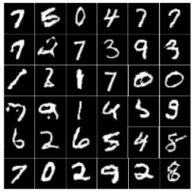

# DCGAN_Tensorflow
Implementation of Deep Convolutional Generative Adversarial Networks on MNIST data in Tensorflow from the paper :

*[Unsupervised Representation Learning with Deep Convolutional Generative Adversarial Networks](https://arxiv.org/abs/1511.06434). Alec Radford, Luke Metz, Soumith Chintala. 2015*

## Implementation details

The discriminator has been implemented following Radford et al. paper.
The architecture used for the discriminator and the generator are explained below. Note the the MNIST data has been padded from 28x28 to 32x32. 

#### Discriminator
`Input : 32x32x1 -> Conv2D :  16x16x32 -> leakyReLU -> Conv2D :  8x8x64  -> BatchNorm -> leakyReLU ->  Conv2D : 4x4x128 -> BatchNorm -> leakyReLU ->  Conv2D : 2x2x256 -> BatchNorm -> leakyReLU -> reshape -> Fully connected 2x2x256 to 1 -> sigmoid (probability of belonging to the dataset.`

For the 2D convolutions, each filter has size 4x4 with padding 1 and strides 2.

#### Generator

`Input : latent space 200 -> fully connected 200 to 512 -> reshape 1x1x512 -> BatchNorm -> ReLU -> FSConv2D : 2x2x256 -> BatchNorm -> ReLU ->  FSConv2D : 4x4x128 -> BatchNorm -> ReLU ->  FSConv2D : 8x8x64 -> BatchNorm -> ReLU ->  FSConv2D : 16x16x32 -> BatchNorm -> ReLU  ->  FSConv2D : 32x32x1 -> tanh`

`FSConv2D` means fractionally strided convolution. All the fractionally strided 2D convolutions at each layer have size of 4x4 with padding 1 and strides 2.

## Prerequisite

* Python 3
* Numpy
* ImageIO
* Tensorflow

## Usage

Use `python train.py` to start training the model.
The discriminator and generator variables and sizes are defined in 'train.py' and 'test.py'. The discriminator and generator models are defined in their own files.

* `test.py` Generates BATCH_SIZE random digits with the generator and saves them as jpg images
* `train.py` Run this file to start training 
* `discriminator.py` discriminator class 
* `generator.py` generator class

## Results 
The image below is an example of 36 randomly generated digits after an hour of training on a GTX 1080 GPU (about 143 epochs). 

# Tensorflow implementations notes
* Do not use tf.reshape or tf.assign in the main training loop. These create new nodes to the graph and slow down the training over time. The graph should be built before the training starts and not be modified afterwards. If reshape is needed in the training loop, it is better to use numpy.reshape.

